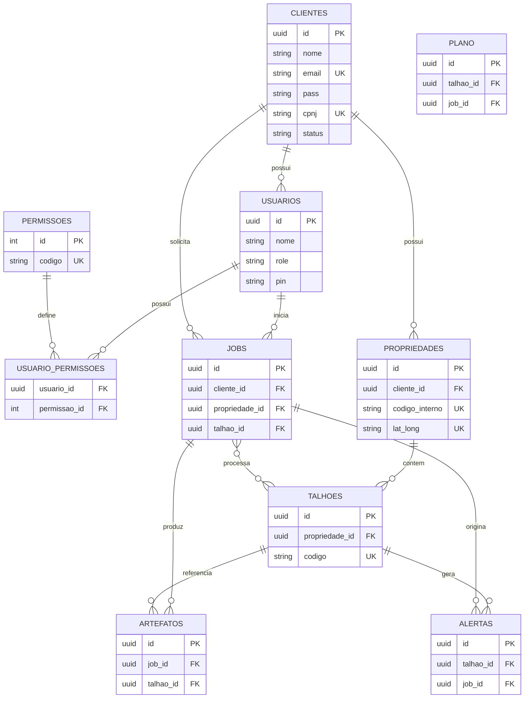

# Plano inicial da nova API Atmos

Este documento consolida as principais decisões e pontos de atenção para iniciar a nova API em Node.js, tomando como base o `Tasks/00_Estruturar.txt`, os relatórios existentes e o estado atual do core em Python (`server.py` e `RELATORIO_MIGRACAO_CORE.md`).

## 00. Tecnologias e stack sugerida
- **Runtime**: Node.js LTS (>= 20) com TypeScript para tipagem estática.
- **Framework HTTP**: Express + `express-async-errors`; avaliar NestJS se precisarmos de DI e organização modular mais rígida.
- **ORM/Query Builder**: Prisma (PostgreSQL como base primária), com migrations versionadas.
- **Autenticação**: JWT (access/refresh) com Bcrypt para senha; integração futura com Auth0/Keycloak se necessário.
- **Documentação**: OpenAPI (Swagger) gerado automaticamente.
- **Validação**: Zod (camada DTO) ou class-validator (caso NestJS).
- **Infra**: Docker Compose para orquestrar API + banco; `.env` versionado com `.env.example`.
- **Integração com core**: módulos internos que chamam os renderizadores Python via CLI/worker ou expõem a nova camada OO (`WorkflowService`) quando disponível como pacote.
- **Observabilidade**: Winston + pino-pretty em dev; métricas Prometheus simples (pendente de confirmar stack).

## 01. Arquitetura e design pattern
- **Camadas**:
  - `api`: controladores Express organizados por domínio (auth, clientes, propriedades, talhões, alertas, mapas, jobs).
  - `services/use-cases`: regras de negócio e orquestração com o core de processamento.
  - `repositories`: abstração do ORM para facilitar testes/mudança de banco.
  - `integrations`: conectores externos (SICAR, futuros).
  - `workers`: filas para jobs longos (ex.: renderização). Inicialmente `bullmq` + Redis.
- **Princípios**:
  - Domain-driven slices (camadas finas por domínio).
  - DTOs explícitos para inputs/outputs.
  - Centralização de erros (middleware).
  - Feature flags para alternar entre core Python legado e módulos novos.
- **Padrões específicos**:
  - Estratégia Command para jobs de processamento (start, status, cancel).
  - Factory para selecionar renderizadores/formatos (HTML map, GeoTIFF, CSV).
  - Adapter para consumir SICAR (normalizar resposta).

## 02. Modelo de dados inicial (PostgreSQL)
### 02.1 Domínios previstos
- `usuarios`: credenciais, papéis (admin, analista, cliente) e vínculo opcional com `clientes`.
- `clientes`: dados cadastrais, documento fiscal, responsável e preferências de operação.
- `propriedades`: áreas macro do cliente (geometria, metadados agronômicos, integração SICAR).
- `talhoes`: subdivisões de propriedades, base para índices e alertas.
- `alertas`: eventos gerados pelo core, possivelmente associados a jobs/talhões.
- `jobs`: execução do pipeline de processamento (entrada, status, resultado).
- `artefatos`: produtos gerados (HTML, GeoTIFF, CSV) com metadados de rastreio.
- `permissoes` e `usuario_permissoes`: governança fina de acesso.
- `consultas_sicar`: histórico de chamadas à API SICAR e dados importados.
- `auditoria`: rastreamento de alterações e ações relevantes.

### 02.2 Dicionário de dados (versão inicial)
#### Tabela `clientes`
| Campo | Tipo | Chave | Restrições | Descrição |
| --- | --- | --- | --- | --- |
| id | uuid | PK | default `uuid_generate_v4()` | Identificador único do cliente |
| nome | varchar(200) |  | not null | Nome fantasia do cliente |
| documento | varchar(20) | Unique | not null | CPF/CNPJ normalizado |
| tipo_documento | enum(`CPF`,`CNPJ`) |  | not null | Diferencia formato do documento |
| email_contato | varchar(200) |  |  | E-mail principal |
| telefone_contato | varchar(30) |  |  | Telefone/WhatsApp |
| responsavel | varchar(200) |  |  | Responsável comercial ou técnico |
| status | enum(`ativo`,`suspenso`,`inativo`) |  | default `ativo` | Situação do cliente |
| config | jsonb |  | default `'{}'` | Preferências de ingestão/alertas |
| criado_em | timestamptz |  | default `now()` | Data de criação |
| atualizado_em | timestamptz |  | default `now()` | Última atualização |

#### Tabela `usuarios`
| Campo | Tipo | Chave | Restrições | Descrição |
| --- | --- | --- | --- | --- |
| id | uuid | PK | default `uuid_generate_v4()` | Identificador do usuário |
| cliente_id | uuid | FK → `clientes.id` |  | Vínculo opcional com cliente |
| nome | varchar(150) |  | not null | Nome completo |
| email | varchar(200) | Unique | not null | Login (case insensitive) |
| hash_senha | varchar(200) |  | not null | Hash bcrypt/scrypt |
| role | enum(`admin`,`gestor`,`analista`,`cliente`) |  | not null | Papel primário |
| status | enum(`ativo`,`bloqueado`,`pendente`) |  | default `ativo` | Estado de uso |
| ultimo_login | timestamptz |  |  | Último acesso |
| tfa_secret | varchar(64) |  |  | Segredo 2FA (quando habilitado) |
| metadata | jsonb |  | default `'{}'` | Configurações adicionais |
| criado_em | timestamptz |  | default `now()` | Data de criação |
| atualizado_em | timestamptz |  | default `now()` | Última atualização |

#### Tabela `permissoes`
| Campo | Tipo | Chave | Restrições | Descrição |
| --- | --- | --- | --- | --- |
| id | serial | PK |  | Identificador interno |
| codigo | varchar(80) | Unique | not null | Identificador legível (`alertas.visualizar`) |
| descricao | varchar(200) |  |  | Descrição curta |
| criado_em | timestamptz |  | default `now()` | Data de criação |

#### Tabela `usuario_permissoes`
| Campo | Tipo | Chave | Restrições | Descrição |
| --- | --- | --- | --- | --- |
| usuario_id | uuid | PK parcial | FK → `usuarios.id` | Referência ao usuário |
| permissao_id | int | PK parcial | FK → `permissoes.id` | Permissão atribuída |
| concedido_por | uuid |  | FK → `usuarios.id` | Usuário que atribuiu |
| criado_em | timestamptz |  | default `now()` | Data de concessão |

#### Tabela `propriedades`
| Campo | Tipo | Chave | Restrições | Descrição |
| --- | --- | --- | --- | --- |
| id | uuid | PK | default `uuid_generate_v4()` | Identificador da propriedade |
| cliente_id | uuid | FK → `clientes.id` | not null | Dono da propriedade |
| nome | varchar(200) |  | not null | Nome amigável |
| codigo_interno | varchar(60) | Unique(`cliente_id`,`codigo_interno`) | not null | Código de referência interna |
| codigo_sicar | varchar(60) | Unique |  | Código CAR quando existente |
| geom | geometry(Polygon,4326) |  |  | Geometria principal (PostGIS) |
| geojson | jsonb |  |  | Representação simplificada (fallback) |
| area_hectares | numeric(12,2) |  |  | Área calculada |
| cultura_principal | varchar(100) |  |  | Ex.: cana, soja |
| safra_atual | varchar(20) |  |  | Identificador de safra |
| metadata | jsonb |  | default `'{}'` | Configurações adicionais |
| criado_em | timestamptz |  | default `now()` | Data de criação |
| atualizado_em | timestamptz |  | default `now()` | Última atualização |

#### Tabela `talhoes`
| Campo | Tipo | Chave | Restrições | Descrição |
| --- | --- | --- | --- | --- |
| id | uuid | PK | default `uuid_generate_v4()` | Identificador do talhão |
| propriedade_id | uuid | FK → `propriedades.id` | not null | Propriedade associada |
| codigo | varchar(60) | Unique(`propriedade_id`,`codigo`) | not null | Código do talhão |
| nome | varchar(120) |  |  | Nome amigável |
| geom | geometry(Polygon,4326) |  |  | Geometria da área |
| geojson | jsonb |  |  | GeoJSON simplificado |
| area_hectares | numeric(12,2) |  |  | Área do talhão |
| variedade | varchar(80) |  |  | Variedade de cana |
| safra | varchar(20) |  |  | Safra aplicável |
| status | enum(`ativo`,`inativo`) |  | default `ativo` | Controle de visibilidade |
| criado_em | timestamptz |  | default `now()` | Data de criação |
| atualizado_em | timestamptz |  | default `now()` | Última atualização |

#### Tabela `jobs`
| Campo | Tipo | Chave | Restrições | Descrição |
| --- | --- | --- | --- | --- |
| id | uuid | PK | default `uuid_generate_v4()` | Identificador do job |
| cliente_id | uuid | FK → `clientes.id` |  | Cliente solicitante |
| propriedade_id | uuid | FK → `propriedades.id` |  | Propriedade em foco |
| talhao_id | uuid | FK → `talhoes.id` |  | Talhão (quando específico) |
| iniciado_por | uuid | FK → `usuarios.id` |  | Usuário que iniciou |
| pipeline | varchar(80) |  | not null | Tipo de pipeline executado |
| status | enum(`pending`,`running`,`succeeded`,`failed`,`canceled`) |  | not null | Estado atual |
| parametros | jsonb |  | not null | Parâmetros de entrada |
| resultado_dir | varchar(255) |  |  | Caminho base dos artefatos |
| erro_mensagem | text |  |  | Mensagem em caso de falha |
| criado_em | timestamptz |  | default `now()` | Recebimento da requisição |
| iniciado_em | timestamptz |  |  | Início efetivo |
| finalizado_em | timestamptz |  |  | Conclusão |

#### Tabela `artefatos`
| Campo | Tipo | Chave | Restrições | Descrição |
| --- | --- | --- | --- | --- |
| id | uuid | PK | default `uuid_generate_v4()` | Identificador do artefato |
| job_id | uuid | FK → `jobs.id` | not null | Job que gerou o arquivo |
| talhao_id | uuid | FK → `talhoes.id` |  | Talhão referenciado |
| tipo | enum(`html`,`geotiff`,`csv`,`png`,`json`) |  | not null | Classe do artefato |
| formato | varchar(40) |  |  | Formato MIME/derivado |
| indice | varchar(40) |  |  | Índice principal (NDVI etc.) |
| caminho | varchar(255) | Unique(`job_id`,`caminho`) | not null | Local relativo/absoluto |
| checksum | varchar(64) |  |  | Hash para integridade |
| metadata | jsonb |  | default `'{}'` | Metadados adicionais |
| gerado_em | timestamptz |  | default `now()` | Criação do artefato |

#### Tabela `alertas`
| Campo | Tipo | Chave | Restrições | Descrição |
| --- | --- | --- | --- | --- |
| id | uuid | PK | default `uuid_generate_v4()` | Identificador do alerta |
| talhao_id | uuid | FK → `talhoes.id` | not null | Talhão relacionado |
| job_id | uuid | FK → `jobs.id` |  | Job que gerou o alerta |
| responsavel_id | uuid | FK → `usuarios.id` |  | Usuário que assumiu |
| tipo | varchar(80) |  | not null | Categoria (stress hídrico etc.) |
| severidade | enum(`baixa`,`media`,`alta`,`critica`) |  | not null | Nível de prioridade |
| titulo | varchar(150) |  |  | Título curto |
| mensagem | text |  |  | Descrição detalhada |
| status | enum(`aberto`,`em_analise`,`resolvido`,`ignorado`) |  | default `aberto` | Estado do alerta |
| payload | jsonb |  | not null | Dados técnicos (índices, coordenadas) |
| gerado_em | timestamptz |  | default `now()` | Data de criação |
| resolvido_em | timestamptz |  |  | Data de resolução |

#### Tabela `consultas_sicar`
| Campo | Tipo | Chave | Restrições | Descrição |
| --- | --- | --- | --- | --- |
| id | uuid | PK | default `uuid_generate_v4()` | Identificador da consulta |
| cliente_id | uuid | FK → `clientes.id` |  | Cliente que requisitou |
| propriedade_id | uuid | FK → `propriedades.id` |  | Propriedade alvo |
| codigo_car | varchar(60) | Unique(`codigo_car`,`propriedade_id`) |  | Código CAR consultado |
| parametros | jsonb |  | not null | Request enviado à API |
| resposta | jsonb |  |  | Dados retornados |
| status | enum(`pending`,`success`,`error`) |  | not null | Resultado da consulta |
| mensagem_erro | text |  |  | Detalhe em caso de erro |
| executado_em | timestamptz |  | default `now()` | Data da chamada |
| atualizado_em | timestamptz |  | default `now()` | Último update |

#### Tabela `auditoria`
| Campo | Tipo | Chave | Restrições | Descrição |
| --- | --- | --- | --- | --- |
| id | bigserial | PK |  | Identificador sequencial |
| tabela | varchar(80) |  | not null | Tabela impactada |
| registro_id | uuid |  | not null | PK do registro alterado |
| acao | enum(`insert`,`update`,`delete`,`login`,`logout`) |  | not null | Tipo de evento |
| dados_antes | jsonb |  |  | Estado anterior (quando aplicável) |
| dados_depois | jsonb |  |  | Estado posterior |
| usuario_id | uuid | FK → `usuarios.id` |  | Autor da ação |
| ip_origem | inet |  |  | IP de origem |
| criado_em | timestamptz |  | default `now()` | Instante registrado |

### 02.3 Diagrama entidade-relacionamento

### 02.4 Índices e considerações adicionais
- Habilitar `uuid-ossp` ou geração via aplicação para PKs UUID.
- Criar índices GIST nas colunas `geom` (`propriedades.geom`, `talhoes.geom`) para queries espaciais.
- Índices parciais úteis: `alertas(status)` para listar pendências, `jobs(status)` para painéis em tempo real.
- Considerar tabelas de histórico (`talhao_indices`) caso seja necessário granularidade por data/índice.
- `consultas_sicar` pode armazenar geometrias importadas em tabela auxiliar (`sicar_poligonos`) referenciando `consultas_sicar.id`.

## 03. Endpoints prioritários
### 03.1 Autenticação e usuários
- `POST /auth/login`: email + senha → tokens.
- `POST /auth/refresh`: refresh token.
- `POST /auth/forgot-password` / `POST /auth/reset-password`.
- `POST /usuarios`: criação (admin).
- `GET /usuarios/me`: perfil e permissões correntes.
- `PATCH /usuarios/:id` & `GET /usuarios`: gestão administrativa.

### 03.2 Clientes e propriedades
- `GET /clientes`: listar com filtros (nome, documento).
- `POST /clientes`: criar novo cliente.
- `GET /clientes/:id`: detalhes incluindo estatísticas agregadas.
- `GET /clientes/:id/propriedades`: listar propriedades.
- `POST /propriedades`: criar/editar com geometria.
- `POST /propriedades/:id/talhoes`: criar/atualizar malha de talhões.
- `GET /propriedades/:id`: detalhes + últimos artefatos.

### 03.3 Talhões e monitoração
- `GET /talhoes/:id`: estado atual, histórico de índices.
- `GET /talhoes/:id/alertas`: alertas por talhão.
- `GET /talhoes/:id/mapas`: links para HTML/GeoTIFF/CSV.

### 03.4 Alertas e análises
- `GET /alertas`: filtros (cliente, severidade, período).
- `POST /alertas/ingest`: endpoint interno para ingestão automática (core).
- `PATCH /alertas/:id`: confirmar, atribuir responsável.

### 03.5 Jobs de processamento
- `POST /jobs`: iniciar pipeline (parametrização similar ao `server.py` atual).
- `GET /jobs`: lista resumida.
- `GET /jobs/:id`: status detalhado + logs.
- `POST /jobs/:id/cancel`: encerrar job ativo.

### 03.6 Artefatos e entrega de mapas
- `GET /artefatos/:id/download`: stream de GeoTIFF/CSV.
- `GET /artefatos/:id/view`: entregar HTML integrado (iframe) para o frontend.
- `GET /produtos/latest`: produto mais recente + índices disponíveis.

### 03.7 Integração com SICAR
- `POST /integracoes/sicar/consultar`: consulta por imóvel (CPF/CNPJ, código CAR).
- `POST /integracoes/sicar/import`: armazenar camada geográfica normalizada.

### 03.8 Saúde e utilidades
- `GET /health`: checar dependências (DB, core, storage).
- `GET /metrics`: expor métricas Prometheus.

## 04. Integrações e requisitos externos
- **Core Python**: encapsular `WorkflowService` (quando disponível) ou CLI; padronizar diretórios de entrada/saída (`dados/`, `mapas/`, `tabelas/`).
- **SICAR**: mapear endpoints oficiais (autenticação, limites de uso, formatos); cache local das respostas.
- **Storage**: avaliar manter artefatos no filesystem + S3 compatível (MinIO) para produção.
- **Autorização**: política RBAC alinhada aos papéis (admin, gestor cliente, operador campo).
- **Envio de notificações**: webhooks/email para alertas críticos (fase posterior).

## 05. Roadmap proposto
1. **Fundação**: bootstrap do projeto Node.js com TypeScript, lint/testes, Docker, CI básico.
2. **Autenticação & usuários**: implementação JWT + RBAC + CRUD inicial.
3. **Módulo clientes/propriedades/talhões**: modelo espacial, integrações GIS básicas.
4. **Jobs & core integration**: wrappers para pipeline atual, armazenamento de artefatos.
5. **Alertas e ingestão**: sincronização com core, filtros, notificações.
6. **Integração SICAR**: criação de conector e fluxo de atualização.
7. **Observabilidade & hardening**: métricas, auditoria, testes de carga.

## 06. Próximos passos imediatos
- Validar stack proposta (especialmente Express vs NestJS) com a equipe.
- Desenhar schema ER detalhado e decidir sobre campos geoespaciais (PostGIS vs JSON).
- Mapear exatamente quais parâmetros do `server.py` viram inputs no `POST /jobs`.
- Especificar contrato do consumidor (frontend) para HTML/GeoTIFF (estratégia CDN ou download direto).
- Definir estratégia de deploy (Docker + ECS/Kubernetes ou VMs) e requisitos de infra mínima.
